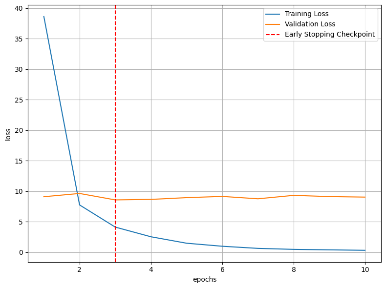
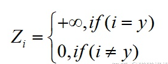
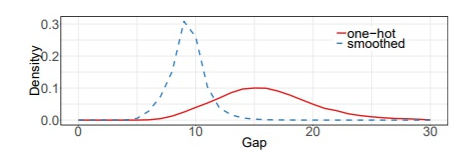
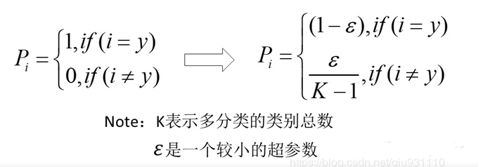
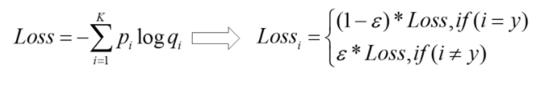
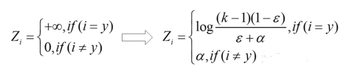

# 【关于 pytorch_pretrained_bert 做文本分类】那些你不知道的事

> 作者：杨夕
> 
> 论文学习项目地址：https://github.com/km1994/nlp_paper_study
> 
> 《NLP 百面百搭》地址：https://github.com/km1994/NLP-Interview-Notes
> 
> 个人介绍：大佬们好，我叫杨夕，该项目主要是本人在研读顶会论文和复现经典论文过程中，所见、所思、所想、所闻，可能存在一些理解错误，希望大佬们多多指正。
> 


> NLP && 推荐学习群【人数满了，加微信 blqkm601 】


- [【关于 pytorch_pretrained_bert 做文本分类】那些你不知道的事](#关于-pytorch_pretrained_bert-做文本分类那些你不知道的事)
  - [一、前言](#一前言)
  - [二、实现功能](#二实现功能)
  - [三、所需环境](#三所需环境)
  - [四、项目目录介绍](#四项目目录介绍)
  - [五、项目使用](#五项目使用)
    - [5.1 模型微调](#51-模型微调)
    - [5.2 模型测试](#52-模型测试)
    - [5.3 模型预测](#53-模型预测)
    - [5.3 模型预测](#53-模型预测-1)
  - [六、代码细节讲解](#六代码细节讲解)
    - [6.1 早停法类讲解](#61-早停法类讲解)
      - [6.1.1 动机](#611-动机)
      - [6.1.2 早停法 介绍](#612-早停法-介绍)
      - [6.1.3 早停法 torch 版本实现](#613-早停法-torch-版本实现)
    - [6.2 标签平滑法](#62-标签平滑法)
      - [6.2.1 动机](#621-动机)
      - [6.2.2 标签平滑法 介绍](#622-标签平滑法-介绍)
      - [6.2.3 标签平滑法 torch 复现](#623-标签平滑法-torch-复现)
    - [6.3 句子分类 Bert 模型输入数据处理类](#63-句子分类-bert-模型输入数据处理类)
      - [6.3.1 介绍](#631-介绍)
      - [6.3.2 句子分类数据处理 方式](#632-句子分类数据处理-方式)
      - [6.3.3 句子分类数据处理类 复现](#633-句子分类数据处理类-复现)
    - [6.4 数据批加载器构建](#64-数据批加载器构建)
      - [6.4.1 介绍](#641-介绍)
      - [6.4.2 数据批加载器 代码复现](#642-数据批加载器-代码复现)
    - [6.5 其他](#65-其他)
  - [参考](#参考)

## 一、前言

本文主要应用 pytorch_pretrained_bert 调用 Bert 模型做中文文本分类任务。

## 二、实现功能

- 利用 pytorch_pretrained_bert 调用 Bert 模型做中文文本分类；
- 实现 EarlyStopping（早停法）；
- 实现 LabelSmoothing（标签平滑）；
- 支持 CPU 和 GPU 间切换；
- 支持模型训练、验证、预测等功能；

## 三、所需环境

- python 3.6+
- pytorch 1.6.0+
- pytorch-pretrained-bert  0.6.2
- pandas
- numpy
- sklearn

## 四、项目目录介绍

- Config.py：配置文件
- DataPrecessForSingleSentence.py：数据预处理 类，将 数据 转化为 Bert 所用格式；
- EarlyStopping.py：  EarlyStopping（早停法）；
- LabelSmoothing.py：  LabelSmoothing（标签平滑）；
- tools.py：   工具类；
- train.py：   模型训练
- test.py：    模型测试
- predict.py： 模型预测

## 五、项目使用

### 5.1 模型微调

```python
    $python train.py
    >>>
    ...
    Epoch:  90%|█████████ | 9/10 [1:11:23<07:55, 475.71s/it]
    Train Iteration:   0%|          | 0/352 [00:00<?, ?it/s]train_loss:0.329693, valid_loss:9.118889, precision:0.977800, recall:0.977800, f1:0.977800 
    EarlyStopping counter: 6 out of 20

    Train Iteration:   0%|          | 1/352 [00:01<07:32,  1.29s/it]0.214194
    Train Iteration:   1%|          | 2/352 [00:02<07:31,  1.29s/it]0.202226
    Train Iteration:   1%|          | 3/352 [00:03<07:32,  1.30s/it]0.197907
    Train Iteration:   1%|          | 4/352 [00:05<07:31,  1.30s/it]0.187890
    Train Iteration:   1%|▏         | 5/352 [00:06<07:30,  1.30s/it]0.175511
    ...
    Train Iteration:  99%|█████████▉| 349/352 [07:34<00:03,  1.30s/it]2.585286
    Train Iteration:  99%|█████████▉| 350/352 [07:35<00:02,  1.30s/it]0.196119
    Train Iteration: 100%|█████████▉| 351/352 [07:36<00:01,  1.30s/it]0.249857
    Train Iteration: 100%|██████████| 352/352 [07:37<00:00,  1.30s/it]

    Dev Iteration:   0%|          | 0/40 [00:00<?, ?it/s]0.140232
    Dev Iteration:   2%|▎         | 1/40 [00:00<00:15,  2.52it/s]
    Dev Iteration:   5%|▌         | 2/40 [00:00<00:15,  2.49it/s]
    ...
    Dev Iteration:  92%|█████████▎| 37/40 [00:15<00:01,  2.39it/s]
    Dev Iteration:  95%|█████████▌| 38/40 [00:15<00:00,  2.38it/s]
    Dev Iteration: 100%|██████████| 40/40 [00:16<00:00,  2.44it/s]
    Epoch: 100%|██████████| 10/10 [1:19:19<00:00, 475.95s/it]train_loss:0.289486, valid_loss:9.157621, precision:0.978200, recall:0.978200, f1:0.978200 
    EarlyStopping counter: 7 out of 20
```

> loss 下降分析图


### 5.2 模型测试

```python
    $python test.py
    >>>
    TEST: 100% 79/79 [00:28<00:00,  2.74it/s]
              precision    recall  f1-score   support

           0       1.00      1.00      1.00      1000
           1       0.98      0.98      0.98      1000
           2       0.98      0.86      0.91      1000
           3       0.89      0.90      0.89      1000
           4       0.98      0.96      0.97      1000
           5       0.97      1.00      0.98      1000
           6       0.96      0.97      0.96      1000
           7       0.98      0.99      0.99      1000
           8       0.97      0.99      0.98      1000
           9       0.93      0.99      0.96      1000

    accuracy                           0.96     10000
   macro avg       0.96      0.96      0.96     10000
weighted avg       0.96      0.96      0.96     10000
```

### 5.3 模型预测

```python
    $python test.py
    >>>
    TEST: 100% 79/79 [00:28<00:00,  2.74it/s]
              precision    recall  f1-score   support

           0       1.00      1.00      1.00      1000
           1       0.98      0.98      0.98      1000
           2       0.98      0.86      0.91      1000
           3       0.89      0.90      0.89      1000
           4       0.98      0.96      0.97      1000
           5       0.97      1.00      0.98      1000
           6       0.96      0.97      0.96      1000
           7       0.98      0.99      0.99      1000
           8       0.97      0.99      0.98      1000
           9       0.93      0.99      0.96      1000

    accuracy                           0.96     10000
   macro avg       0.96      0.96      0.96     10000
weighted avg       0.96      0.96      0.96     10000
```

### 5.3 模型预测

```python
    $python predict.py
    >>>
    输入句子：5倍光变徕卡镜头！松下FS15降至1399【山东IT在线报道】松下发布的面向家用入门市场的松下FS15，采用了1210万像素、5倍光学变焦莱卡镜头，并且配备了第四代维纳斯图像处理引擎，同时还加入了先进的智能场景模式，目前这款相机在商家济南瀚正龙的售价降为1399元。在外观方面，松下FS15基本延续了松下FS系列一贯的设计风格，小巧的机身设计配以柔美的线条，无论在任何角度，用户将这款小巧的卡片机拿在手上都显得格外时尚。松下FS15配置了一枚1200万有效像素莱卡镜头，支持拍摄最大分辨率为4000×3000的照片，支持4:3、3:2和16:9比例的照片拍摄，搭配5倍光学变焦的徕卡镜头，等效焦距为29-145mm，最大光圈为F3.3-F5.9，快门速度为8-1/2000秒，感光度为ISO 80/100/200/400/800/1600，高感光度模式可以达到ISO 6400。在机身正面，松下FS15配置了一块2.7英寸23万像素的LCD液晶显示屏，显示效果还是相当不错的。97.0×54.4×21.7mm机身三围以及138g的机身重量，松下FS15可谓是相当轻巧，方便用户外出旅游时携带。
    Predict: 100% 1/1 [00:00<00:00, 36.40it/s]
    pred_labels:[8]
    pred_labels:科技
    输入句子：做好配置等于投资成功一半国泰基金 阿邰你应该忘掉市场时机选择；你应该忘掉个股选择；在投资组合的收益中，几乎94%可以由其资产的配置单来解释；你应该做一个资产的配置者。——布林森(Brinson)、霍德(Hood)和比鲍尔(Beebower)(简称BHB)2008年是充满期待又饱受打击的一年，不少投资者的资产严重缩水，许多人都将其归结于年轻的资本市场遭遇了金融危机的洗礼。其实，很多投资者可能没有给予资产配置足够关注，有研究表明，投资收益的大部分的贡献来自于资产配置。就如霍德和比鲍尔等人(BHB)在名为《投资组合表现的决定性因素》的著名文章中所提到的——“你应该忘掉市场时机选择；你应该忘掉个股选择；在投资组合的收益中，几乎94%可以由其资产的配置单来解释；你应该做一个资产的配置者。”在基金投资中，资产配置同样是至关重要的环节。合理科学的配置才能在增强资金安全性的同时抓住市场向上的投资机会，做到“进可攻、退可守”。根据投资目标、风险承受能力和投资金额等，投资者采取不同的投资策略，可将资产按不同比例配置在股票型基金和各类固定收益类基金上。对于20岁出头的年轻人来说，购买住房和汽车是走上工作岗位后最初的奋斗目标。这部分年轻人收入增长较快，能承受较大风险，对收益期望较高，可较大比例地配置具有成长性的股票型基金，但绝对不能忽视对风险和收益的平衡，适当配置固定收益类基金可起到控制风险的作用。人到中年，为子女筹划将来的教育基金也成为头等大事。因此建议提高固定收益类基金的配置比例，加大对风险的控制力度。老年人收入不如中青年丰厚，且上涨空间也不多，投入的资金都是养老钱，对资金安全性的要求是重中之重，建议大比例配置收益稳定、风险较小的债券或货币基金，而股票基金的比重应尽量降低，或者选择表现稳健的混合偏股基金，构建适合自身风险承受能力的资产组合。从目前已公开的2008年投资总结来看，成绩较好的投资者和专业投资机构大多胜在资产配置，可见资产配置在投资中所扮演的重要角色。而根据自身不同的风险承受能力和收益期望，来做相应的资产配置，更是需要在长远的投资中仔细研究和推敲的。
    Predict: 100% 1/1 [00:00<00:00, 37.46it/s]
    pred_labels:[9]
    pred_labels:财经
```

## 六、代码细节讲解

### 6.1 早停法类讲解

#### 6.1.1 动机

模型训练过程中，训练 loss 和 验证 loss 在训练初期都是 呈下降趋势；当训练到达一定程度之后， 验证 loss 并非继续随 训练 loss 一样下降，而是 出现上升的趋势，此时，如果继续往下训练，容易出现 模型性能下降问题，也就是我们所说的过拟合问题。

那么，有什么办法可以避免模型出现该问题呢？

这个就是本节 所介绍的方法 —— 早停法

#### 6.1.2 早停法 介绍

早停法 就是在训练中计算模型在验证集上的表现，当模型在验证集上的表现开始下降的时候，停止训练，这样就能避免模型由于继续训练而导致过拟合的问题。所以说 早停法 结合交叉验证法可以防止模型过拟合。

#### 6.1.3 早停法 torch 版本实现

```python
import torch
import numpy as np
# 早停法
class EarlyStopping:
    """Early stops the training if validation loss doesn't improve after a given patience."""
    def __init__(self, patience=7, verbose=False, delta=0):
        """
        Args:
            patience (int): How long to wait after last time validation loss improved.
                            Default: 7
            verbose (bool): If True, prints a message for each validation loss improvement. 
                            Default: False
            delta (float): Minimum change in the monitored quantity to qualify as an improvement.
                            Default: 0
        """
        self.patience = patience
        self.verbose = verbose
        self.counter = 0
        self.best_score = None
        self.early_stop = False
        self.val_loss_min = np.Inf
        self.delta = delta

    def __call__(self, val_loss, model, model_path):
        '''
            功能：早停法 计算函数
            input:
                val_loss         验证损失
                model            模型
                model_path       模型保存地址
        '''
        score = -val_loss

        if self.best_score is None:
            self.best_score = score
            self.save_checkpoint(val_loss, model, model_path)
        elif score < self.best_score + self.delta:
            self.counter += 1
            print(f'EarlyStopping counter: {self.counter} out of {self.patience}')
            if self.counter >= self.patience:
                self.early_stop = True
        else:
            self.best_score = score
            self.save_checkpoint(val_loss, model, model_path)
            self.counter = 0

    # 功能：当验证损失减少时保存模型
    def save_checkpoint(self, val_loss, model, model_path):
        '''
            功能：当验证损失减少时保存模型
            input:
                val_loss         验证损失
                model            模型
                model_path       模型保存地址
        '''
        if self.verbose:
            print(f'Validation loss decreased ({self.val_loss_min:.6f} --> {val_loss:.6f}).  Saving model ...')
        # torch.save(model.state_dict(), 'checkpoint_loss.pt')
        torch.save(model, open(model_path, "wb"))
        self.val_loss_min = val_loss
```

### 6.2 标签平滑法

#### 6.2.1 动机

- 交叉熵损失函数在多分类任务中存在的问题

多分类任务中，神经网络会输出一个当前数据对应于各个类别的置信度分数，将这些分数通过softmax进行归一化处理，最终会得到当前数据属于每个类别的概率。

然后计算交叉熵损失函数：


训练神经网络时，最小化预测概率和标签真实概率之间的交叉熵，从而得到最优的预测概率分布。最优的预测概率分布是：



**神经网络会促使自身往正确标签和错误标签差值最大的方向学习，在训练数据较少，不足以表征所有的样本特征的情况下，会导致网络过拟合。**

#### 6.2.2 标签平滑法 介绍

label smoothing可以解决上述问题，这是一种正则化策略，主要是通过 soft one-hot 来加入噪声，减少了真实样本标签的类别在计算损失函数时的权重，最终起到抑制过拟合的效果。



增加label smoothing后真实的概率分布有如下改变：



交叉熵损失函数的改变如下：



最优预测概率分布如下：



#### 6.2.3 标签平滑法 torch 复现

```python
import torch.nn as nn
from torch.autograd import Variable
# 标签平滑发
class LabelSmoothing(nn.Module):
    def __init__(self, size, smoothing=0.0):
        super(LabelSmoothing, self).__init__()
        '''
            nn.KLDivLoss : KL 散度
            功能： 计算input和target之间的KL散度( Kullback–Leibler divergence)
        '''
        self.criterion = nn.KLDivLoss(size_average=False)
        #self.padding_idx = padding_idx
        self.confidence = 1.0 - smoothing  #if i=y的公式
        self.smoothing = smoothing
        self.size = size
        self.true_dist = None
    
    def forward(self, x, target):
        """
        input:
            x 表示输入 (N，M)N个样本，M表示总类数，每一个类的概率log P
            target表示label（M，）
        return:
            Loos 
        """
        assert x.size(1) == self.size
        true_dist = x.data.clone()#先深复制过来
        true_dist.fill_(self.smoothing / (self.size - 1))#otherwise的公式
        # 变成one-hot编码，1表示按列填充，
        # target.data.unsqueeze(1)表示索引,confidence表示填充的数字
        true_dist.scatter_(1, target.data.unsqueeze(1), self.confidence)
        self.true_dist = true_dist
        return self.criterion(x, Variable(true_dist, requires_grad=False))
```

### 6.3 句子分类 Bert 模型输入数据处理类

#### 6.3.1 介绍

1. 因为 本项目 处理的是单句序列，按照BERT中的序列处理方式，需要在输入序列头尾分别拼接特殊字符'CLS'与'SEP'，因此不包含两个特殊字符的序列长度应该小于等于max_seq_len-2，如果序列长度大于该值需要那么进行截断。
2. 对输入的序列 最终形成['CLS',seq,'SEP']的序列，该序列的长度如果小于max_seq_len，那么使用0进行填充。

#### 6.3.2 句子分类数据处理 方式

对于 输入 Bert 模型的句子，需要做一定的处理：

- seq         : 在入参seq的头尾分别拼接了'CLS'与'SEP'符号，如果长度仍小于max_seq_len，则使用0在尾部进行了填充。
- seq_mask    : 只包含0、1且长度等于seq的序列，用于表征seq中的符号是否是有意义的，如果seq序列对应位上为填充符号，那么取值为1，否则为0。
- seq_segment : shape等于seq，因为是单句，所以取值都为0。

#### 6.3.3 句子分类数据处理类 复现

> 类实现
```python
from concurrent.futures import ThreadPoolExecutor
# 句子分类 Bert 模型输入数据处理类
class DataPrecessForSingleSentence(object):
    """
        句子分类 Bert 模型输入数据处理类
    """

    def __init__(self, bert_tokenizer, max_workers=10):
        """
            bert_tokenizer :分词器
            max_workers        : 线程数
        """
        self.bert_tokenizer = bert_tokenizer
        # 创建多线程池
        self.pool = ThreadPoolExecutor(max_workers=max_workers)
        # 获取文本与标签

    def get_input(self, dataset, max_seq_len=50):
        """
            功能：通过多线程（因为notebook中多进程使用存在一些问题）的方式对输入文本进行分词、ID化、截断、填充等流程得到最终的可用于模型输入的序列。

            input:
                dataset     : pandas的dataframe格式，包含两列，第一列为文本，第二列为标签。标签取值为{0,1}，其中0表示负样本，1代表正样本。
                max_seq_len : 目标序列长度，该值需要预先对文本长度进行分别得到，可以设置为小于等于512（BERT的最长文本序列长度为512）的整数。

            return:
                seq         : 在入参seq的头尾分别拼接了'CLS'与'SEP'符号，如果长度仍小于max_seq_len，则使用0在尾部进行了填充。
                seq_mask    : 只包含0、1且长度等于seq的序列，用于表征seq中的符号是否是有意义的，如果seq序列对应位上为填充符号，
                              那么取值为1，否则为0。
                seq_segment : shape等于seq，因为是单句，所以取值都为0。
                labels      : 标签取值为 0-9 ,表示 10 种类别。   
        """
        sentences = dataset.iloc[:, 0].tolist()
        labels = dataset.iloc[:, 1].tolist()
        # 切词
        tokens_seq = list(
            self.pool.map(self.bert_tokenizer.tokenize, sentences))
        # 获取定长序列及其mask
        result = list(
            self.pool.map(self.trunate_and_pad, tokens_seq,
                          [max_seq_len] * len(tokens_seq)))
        seqs = [i[0] for i in result]
        seq_masks = [i[1] for i in result]
        seq_segments = [i[2] for i in result]
        return seqs, seq_masks, seq_segments, labels

    def trunate_and_pad(self, seq, max_seq_len):
        """
            功能：
                1. 因为本类处理的是单句序列，按照BERT中的序列处理方式，需要在输入序列头尾分别拼接特殊字符'CLS'与'SEP'，
                因此不包含两个特殊字符的序列长度应该小于等于max_seq_len-2，如果序列长度大于该值需要那么进行截断。
                2. 对输入的序列 最终形成['CLS',seq,'SEP']的序列，该序列的长度如果小于max_seq_len，那么使用0进行填充。

            input: 
                seq         : 输入序列，在本处其为单个句子。
                max_seq_len : 拼接'CLS'与'SEP'这两个特殊字符后的序列长度

            return:
                seq         : 在入参seq的头尾分别拼接了'CLS'与'SEP'符号，如果长度仍小于max_seq_len，则使用0在尾部进行了填充。
                seq_mask    : 只包含0、1且长度等于seq的序列，用于表征seq中的符号是否是有意义的，如果seq序列对应位上为填充符号，
                              那么取值为1，否则为0。
                seq_segment : shape等于seq，因为是单句，所以取值都为0。
           
        """
        # 对超长序列进行截断
        if len(seq) > (max_seq_len - 2):
            seq = seq[0:(max_seq_len - 2)]
        # 分别在首尾拼接特殊符号
        seq = ['[CLS]'] + seq + ['[SEP]']
        # ID化
        seq = self.bert_tokenizer.convert_tokens_to_ids(seq)
        # 根据max_seq_len与seq的长度产生填充序列
        padding = [0] * (max_seq_len - len(seq))
        # 创建seq_mask
        seq_mask = [1] * len(seq) + padding
        # 创建seq_segment
        seq_segment = [0] * len(seq) + padding
        # 对seq拼接填充序列
        seq += padding
        assert len(seq) == max_seq_len
        assert len(seq_mask) == max_seq_len
        assert len(seq_segment) == max_seq_len
        return seq, seq_mask, seq_segment
```

> 句子分类数据处理类 调用
```python
    # 分词工具
    bert_tokenizer = BertTokenizer.from_pretrained(config.bert_model_path, do_lower_case=config.do_lower_case)
    # 类初始化
    processor = DataPrecessForSingleSentence(bert_tokenizer= bert_tokenizer)
    # 加载预训练的bert模型
    model = BertForSequenceClassification.from_pretrained(config.bert_model_path, num_labels=config.num_labels)
```

### 6.4 数据批加载器构建

#### 6.4.1 介绍

为了充分利用 机器资源，需要对数据进行 批操作。

#### 6.4.2 数据批加载器 代码复现

> 数据批加载器 函数
```python
import torch
from torch.utils.data import DataLoader, RandomSampler, TensorDataset
# 功能：数据加载器构建
def build_data(processor,data,batch_size):
    '''
        功能：数据加载器构建
    '''
    # 产生训练集输入数据
    seqs, seq_masks, seq_segments, labels = processor.get_input(dataset=data)
    # 转换为torch tensor
    t_seqs = torch.tensor(seqs, dtype=torch.long)
    t_seq_masks = torch.tensor(seq_masks, dtype = torch.long)
    t_seq_segments = torch.tensor(seq_segments, dtype = torch.long)
    t_labels = torch.tensor(labels, dtype = torch.long)

    data = TensorDataset(t_seqs, t_seq_masks, t_seq_segments, t_labels)
    sampler = RandomSampler(data)
    dataloder = DataLoader(dataset= data, sampler=sampler, batch_size = batch_size)
    return dataloder
```

> 方法调用
```python
    # 数据加载器构建
    train_dataloder = build_data(processor,train,config.batch_size)
    valid_dataloder = build_data(processor,valid,config.batch_size)
```

### 6.5 其他

其他模块 和 普通的 torch 模型训练差不多，此次不做延伸介绍，感兴趣可以自己看代码。

## 参考

1. [基于pytorch版bert的中文文本分类](https://zhuanlan.zhihu.com/p/145192287)
2. [label smoothing(标签平滑)学习笔记](https://zhuanlan.zhihu.com/p/116466239)
3. [标签平滑&深度学习：Google Brain解释了为什么标签平滑有用以及什么时候使用它](https://zhuanlan.zhihu.com/p/101553787)
